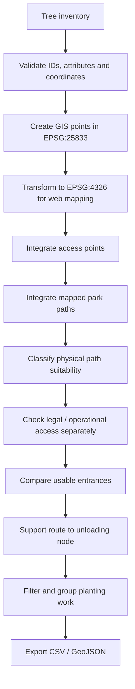

# Workflow diagram

```mermaid
flowchart TD
    A[Tree inventory] --> B[Validate IDs, attributes and coordinates]
    B --> C[Create GIS points in EPSG:25833]
    C --> D[Transform to EPSG:4326 for web mapping]
    D --> E[Integrate access points]
    E --> F[Integrate mapped park paths]
    F --> G[Classify physical path suitability]
    G --> H[Check legal / operational access separately]
    H --> I[Compare usable entrances]
    I --> J[Support route to unloading node]
    J --> K[Filter and group planting work]
    K --> L[Export CSV / GeoJSON]
```
